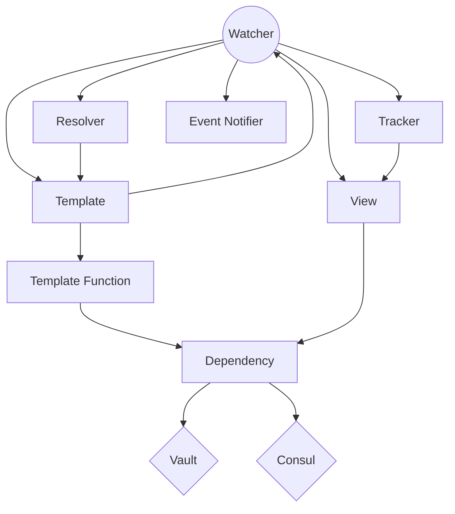
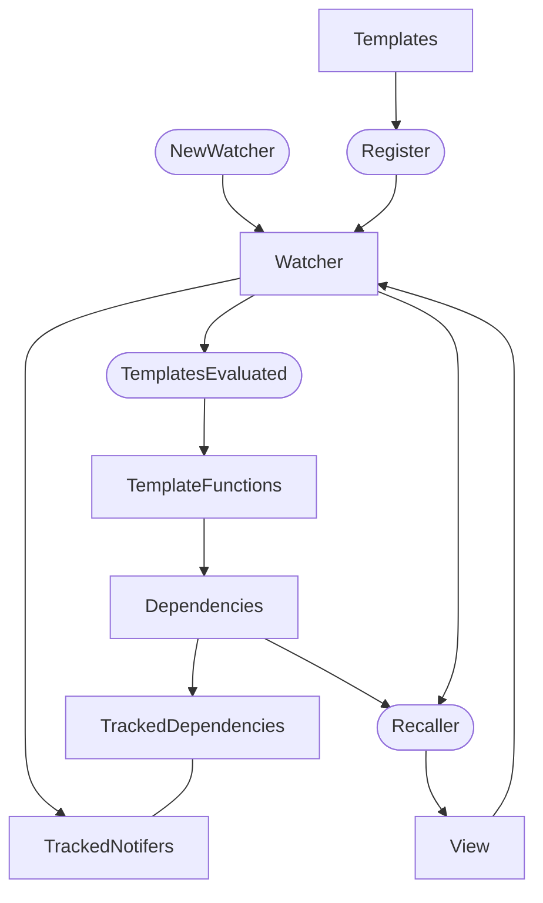
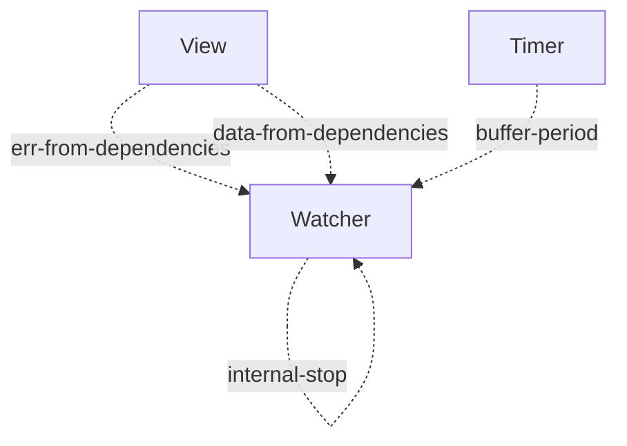
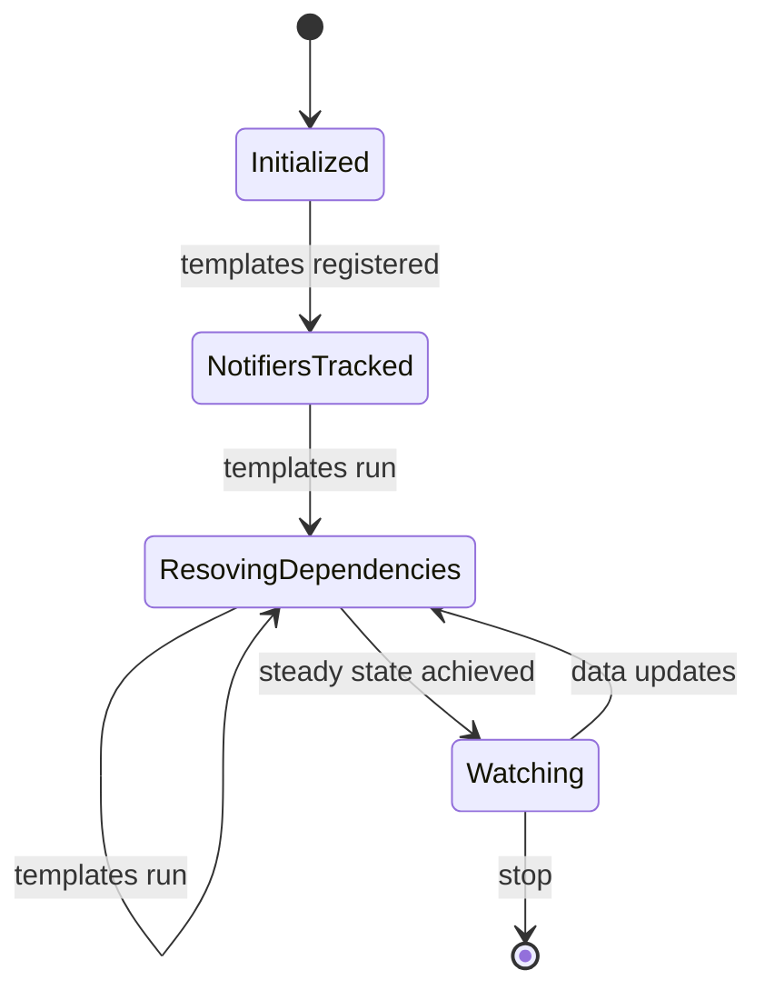
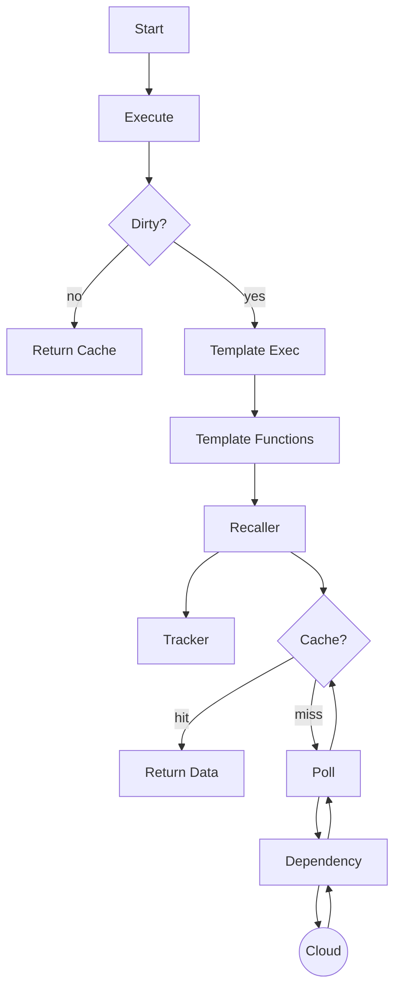
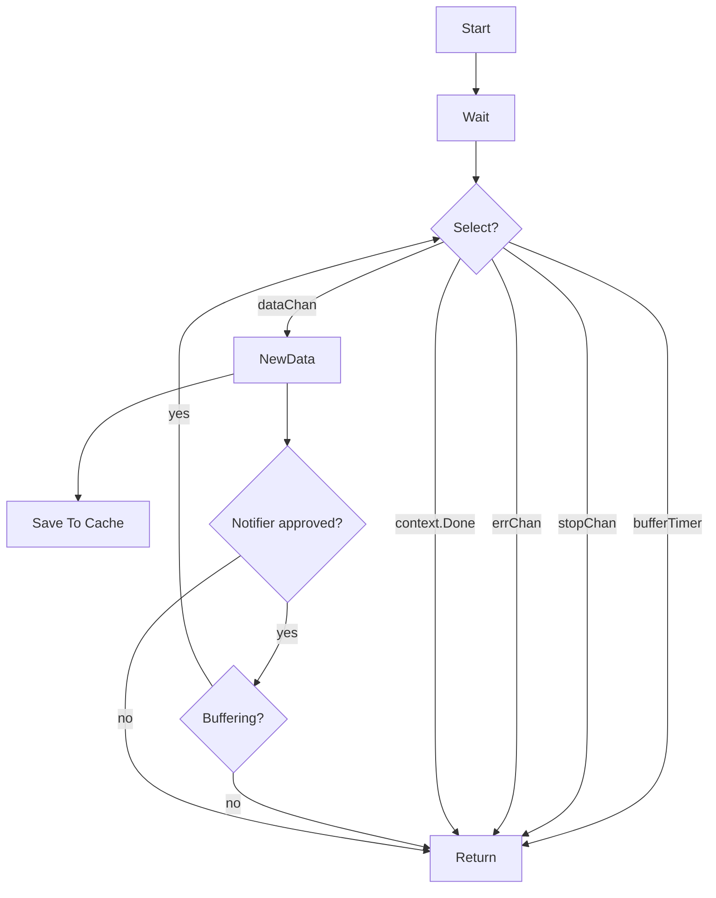

*This package is unreleased, alpha quality that will have API breaking changes
as we get it in shape. We'll do an official release when it is ready.*

# Hashicorp Configuration And Templating (hashicat) library

This library provides a means to fetch data managed by external services and
render templates using that data. It also enables monitoring those services for
data changes to trigger updates to the templates.

It currently supports Consul and Vault as data sources, but we expect to add
more soon.

This library was originally based on the code from Consul-Template with a fair
amount of refactoring.

## Community Support

If you have questions about hashicat, its capabilities or anything other than a
bug or feature request (use github's issue tracker for those), please see our
community support resources.

Community portal: https://discuss.hashicorp.com/c/consul

Other resources: https://www.consul.io/community.html

Additionally, for issues and pull requests we'll be using the :+1: reactions as
a rough voting system to help gauge community priorities. So please add :+1: to
any issue or pull request you'd like to see worked on. Thanks.

## Diagrams

While the primary documentation for Hashicat is intended to use official godocs
formatting, I thought a few diagrams might help get some aspects across better
and have been working on a few. I'm not great at it but with mermaid I'm hoping
to incrementally improve them over time. Please feel free to file issues/PRs
against them if you have ideas. Thanks.

### Overview

These are some general attempts to get an high level view of what's going on with mixed results. Might be useful...

This diagram is kind of "thing" (struct) oriented. Showing the main structs and
the contact points between them.

This diagram was another attempt at the above but including more information on
what the contact points are and the general flow of things. In it the squares are
structs and the ovals are calls/things-happening.

### Channels

This shows the main internal channels.

### States

I thought a state diagram was a good idea until I realized there just aren't
that many states.

### Template.Execute() Flow

This is probably one of the more useful diagrams, dipicting the call flow of
a Template execution. Note that "Dirty" is a term I swiped from filesystems, it
denotes that some data that the template uses has been changed.

### Watcher.Wait() Flow

Similar to the above.. What happens when you call watcher.Wait()?

